# Stock Price Prediction Using LSTM Neural Networks

## Table of Contents

- [Project Definition](#project-definition)
- [Analysis](#analysis)
- [Methodology](#methodology)
- [Results](#results)
- [Conclusion](#conclusion)
- [Stock Predictor App](#stock-predictor-app)
- [Project Structure](#project-structure)
- [License](#license)
- [Acknowledgements](#acknowledgements)

---

## Project Definition
### Project Overview

In today's dynamic financial markets, accurate stock price prediction is a valuable asset for investors and traders. This project focuses on developing individual Long Short-Term Memory (LSTM) neural network models to predict future stock prices for five selected tickers: **AAPL**, **GOOG**, **META**, **MSFT**, and **AMZN**. Leveraging deep learning techniques for time series forecasting, the dataset includes historical stock prices and associated financial indicators.

### Problem Statement
The primary challenge is to create robust predictive models capable of forecasting future stock prices across multiple tickers with varying market behaviors. Stock prices are influenced by numerous factors, making prediction complex. Using LSTM models is advantageous due to their effectiveness in capturing temporal dependencies in sequential data. The expected outcome is a set of LSTM models, each optimized to minimize prediction error for its respective stock, providing reliable forecasts to aid investment decisions.

### Metrics
The **Symmetric Mean Absolute Percentage Error (SMAPE)** is the chosen metric for evaluating model performance. SMAPE provides a scale-independent percentage error, making it suitable for comparing performance across different stocks with varying price ranges. It balances the relative errors between overestimation and underestimation, offering a more nuanced evaluation compared to traditional metrics like Mean Squared Error (MSE).

## Analysis
### Data Exploration

The dataset is comprised of daily historical stock data for the five selected tickers over the past several years. Key features include:

- **Open**: The opening price of the stock.
- **High**: The highest price of the stock during the trading day.
- **Low**: The lowest price of the stock during the trading day.
- **Close**: The closing price of the stock.
- **Adj Close**: The adjusted closing price, accounting for dividends and stock splits.
- **Volume**: The number of shares traded.

Initial exploration involved data visualizations to understand data distributions, trends, and volatility patterns. Certain stocks exhibited higher volatility, suggesting potential challenges in prediction.

### Data Visualization

To gain insights, several visualizations were created:

**Time Series Plots**: Displaying normalized historical price movements for each ticker to observe trends and seasonality.

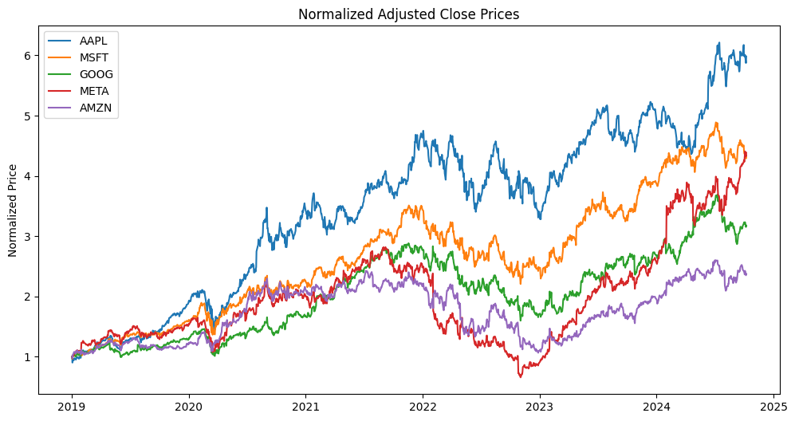

**Moving Averages**: Interactive plots using Plotly to show how the 20-day and 50-day moving averages track with the adjusted close price for each ticker.

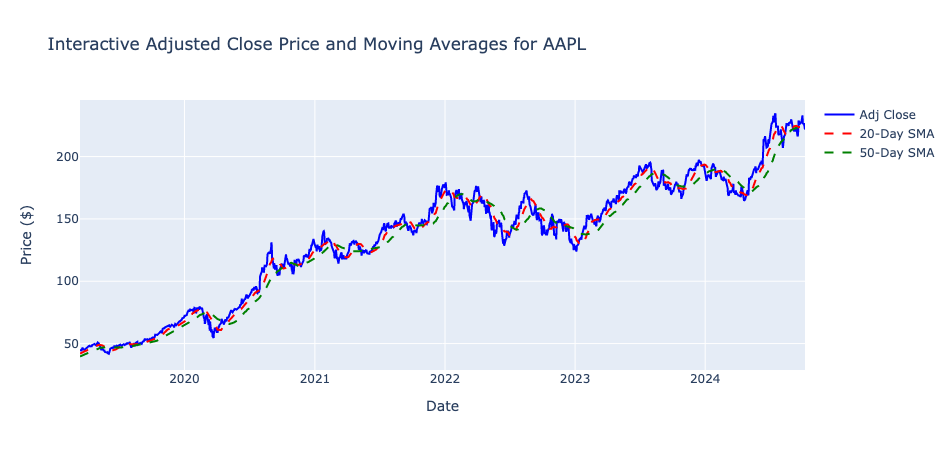

**Box Plots**: Highlighting the distribution and volatility of stock prices to identify outliers and variance.

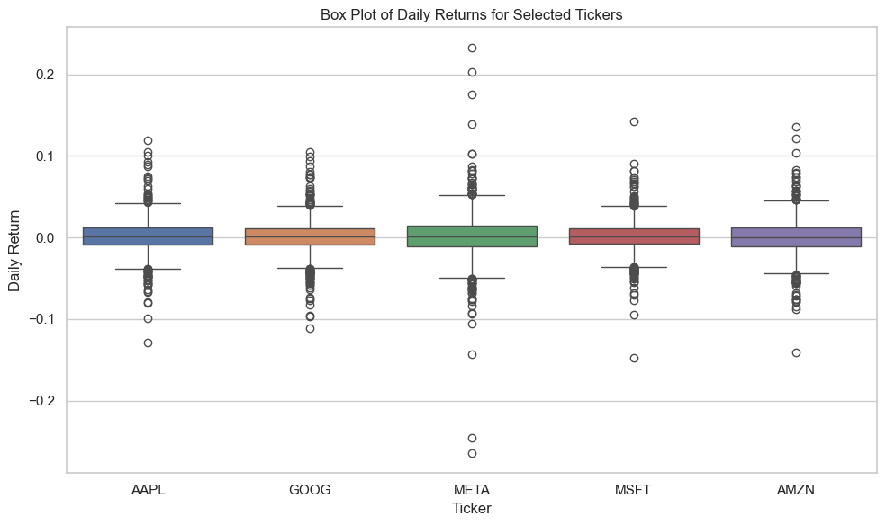


## Methodology

### Data Preprocessing

Data preprocessing is a critical step in preparing the dataset for LSTM modeling. The following steps were undertaken:

1. **Feature Engineering**: Additional technical indicators and date-related features were computed:

    - Technical Indicators: Simple Moving Averages (SMA_20, SMA_50), Exponential Moving Average (EMA_20), Relative Strength Index (RSI), and moving averages of volume, high, low, and open prices.
    - Date Features: Day, month, year, and day of the week extracted from the date index to capture seasonal patterns.

2. **Handling Missing Values**: Rows with NaN values resulting from the computation of technical indicators were dropped.

3. **Normalization**: Features were scaled using Min-Max Scaler to ensure efficient model training:
```python
feature_scaler = MinMaxScaler()
target_scaler = MinMaxScaler()
scaled_features = feature_scaler.fit_transform(df[features])
scaled_target = target_scaler.fit_transform(df[[target]])
```
4. **Sequence Creation**: Sequences were created to capture temporal dependencies:
```python
def create_sequences(features_data, target_data, seq_length):
    xs = []
    ys = []
    for i in range(len(features_data) - seq_length):
        x = features_data[i:(i + seq_length)]
        y = target_data[i + seq_length]  # Target is 'Adj Close' at next time step
        xs.append(x)
        ys.append(y)
    return np.array(xs), np.array(ys)
```
5. **Data Splitting**: The data was split into training, validation, and test sets while preserving temporal order to prevent data leakage:


```python
total_samples = len(X)
test_size = int(test_split * total_samples)
val_size = int(validation_split * total_samples)
train_size = total_samples - val_size - test_size

X_train = X[:train_size]
y_train = y[:train_size]

X_val = X[train_size:train_size + val_size]
y_val = y[train_size:train_size + val_size]

X_test = X[train_size + val_size:]
y_test = y[train_size + val_size:]
```

### Implementation
The LSTM model was implemented using **PyTorch**. The architecture consisted of:

- **Input Layer**: Corresponding to the defined window size and number of features.
- **LSTM Layers**: Two layers with 128 hidden units each, allowing the model to capture complex temporal patterns.
- **Dropout Layer**: Applied between LSTM layers to prevent overfitting.

- **Fully Connected Output Layer**: Producing the final prediction of the adjusted closing price.

The model class is defined as follows:

```python
class LSTMModel(nn.Module):
    def __init__(self, input_size, hidden_size, num_layers, output_size, dropout):
        super(LSTMModel, self).__init__()
        self.hidden_size = hidden_size
        self.num_layers = num_layers
        self.lstm = nn.LSTM(
            input_size, hidden_size, num_layers,
            batch_first=True, dropout=dropout
        )
        self.dropout_layer = nn.Dropout(p=dropout)
        self.fc = nn.Linear(hidden_size, output_size)

    def forward(self, x):
        h0 = torch.zeros(self.num_layers, x.size(0), self.hidden_size).to(x.device)
        c0 = torch.zeros(self.num_layers, x.size(0), self.hidden_size).to(x.device)
        out, _ = self.lstm(x, (h0, c0))
        out = self.dropout_layer(out[:, -1, :])
        out = self.fc(out)
        return out
```


### Training Process
The training process involved the following steps:

- Hyperparameter Definition:
```python
input_size = X_train.shape[2]
hidden_size = 128
num_layers = 2
output_size = 1
num_epochs = 300
learning_rate = 0.0001
dropout = 0.2
patience = 200  # For early stopping
```

- **Loss Function** and **Optimizer**:
```python
criterion = nn.MSELoss()
optimizer = torch.optim.Adam(model.parameters(), lr=learning_rate)
```
- **Early Stopping**: Implemented to prevent overfitting by monitoring the validation loss:
```python
if val_loss < best_val_loss:
    best_val_loss = val_loss
    epochs_no_improve = 0
    best_model_state = model.state_dict()
else:
    epochs_no_improve += 1
    if epochs_no_improve >= patience:
        print(f"Early stopping at epoch {epoch + 1}")
        break
```
- **Per-Ticker Training**: Each ticker was processed individually, allowing for ticker-specific model tuning.


### Prediction
After training, the models were used to predict future stock prices. The prediction process involved the following steps:

1. Model and Scaler Loading: A function was created to load the trained model and associated scalers for a given ticker:

```python
def load_model_and_scalers(ticker, model_dir='saved_models'):
    # Construct the path to the ticker's subdirectory
    ticker_dir = os.path.join(model_dir, ticker)
    model_path = os.path.join(ticker_dir, 'model.pth')
    scaler_path = os.path.join(ticker_dir, 'scalers.pkl')
    # Load scalers
    with open(scaler_path, 'rb') as f:
        scalers = joblib.load(f)
    feature_scaler = scalers['feature_scaler']
    target_scaler = scalers['target_scaler']
    # Initialize the model with the correct input size
    input_size = len(feature_scaler.scale_)
    model = LSTMModel(input_size, hidden_size, num_layers, output_size, dropout).to(device)
    # Load the model state
    model.load_state_dict(torch.load(model_path, map_location=device))
    model.eval()
    return model, feature_scaler, target_scaler
```

2. **Future Price Prediction**: A function was developed to predict future adjusted close prices for given dates:
```python
def predict_future_prices(ticker, query_dates, model, feature_scaler, target_scaler, recent_data, sequence_length=60):
    # Convert query_dates to datetime objects
    query_dates = [pd.to_datetime(date) for date in query_dates]
    # Filter out non-trading days (weekends)
    trading_days = [date for date in query_dates if date.weekday() < 5]
    # Initialize last_sequence with recent_data
    last_sequence = recent_data.copy(deep=True)
    for date in trading_days:
        # Prepare the input sequence
        temp_sequence = last_sequence[-sequence_length:].copy()
        # Add date-related features
        temp_sequence['Day'] = temp_sequence.index.day
        temp_sequence['Month'] = temp_sequence.index.month
        temp_sequence['Year'] = temp_sequence.index.year
        temp_sequence['Day_of_Week'] = temp_sequence.index.dayofweek
        # Fill any missing values
        temp_sequence = temp_sequence.ffill().bfill()
        # Scale features
        scaled_features = feature_scaler.transform(temp_sequence[features].values)
        # Make prediction
        X_input_tensor = torch.tensor(scaled_features.reshape(1, sequence_length, -1), dtype=torch.float32).to(device)
        with torch.no_grad():
            y_pred = model(X_input_tensor)
        predicted_adj_close = target_scaler.inverse_transform(y_pred.cpu().numpy()).flatten()[0]
        # Handle new data
        # ...
    return predictions

```
3. **Handling New Data**: Since future data is not available, the model uses estimated values for features like open, high, low, close, and volume by calculating rolling means from recent data.

4. **Multi-Ticker Prediction**: A function was created to predict prices for multiple tickers:

```python
def predict_future_prices_multiple_tickers(tickers, query_dates, models_info, ticker_data, sequence_length=60):
    all_predictions = {}
    for ticker in tickers:
        model_info = models_info[ticker]
        predictions = predict_future_prices(
            ticker,
            query_dates,
            model_info['model'],
            model_info['feature_scaler'],
            model_info['target_scaler'],
            ticker_data[ticker],
            sequence_length
        )
        all_predictions[ticker] = predictions
    return all_predictions
```
5. **Prediction Execution**: The models were loaded, and predictions were made for the next seven trading days for each ticker.

### Refinement
Complications arose in hyperparameter tuning, as parameters that optimized performance for one ticker did not necessarily translate to others. This required iterative adjustments and testing across different configurations. To enhance model performance:

- **Fine-Tuning Hyperparameters**: Learning rate, batch size, number of epochs, and the number of LSTM units were adjusted for each ticker.
- **Regularization Techniques**: Early stopping and dropout were implemented to prevent overfitting.
- **Model Saving**: The best model state was saved based on validation loss, ensuring the most effective model was preserved.

## Results
### Model Evaluation and Validation
The final models' performance was evaluated using SMAPE, with the following results:


| Ticker     | SMAPE (%)     | RSME       | MAE        | Dir. Acc. (%)| R-squared |
|------------|---------------|------------|------------|--------------|-----------|
| AAPL       | 3.18          | 7.96       | 6.63       | 53.38        | 0.8702    |
| GOOG       | 4.61          | 10.22      | 8.02       | 51.53        | 0.0302    |
| META       | 3.85          | 25.45      | 19.37      | 44.36        | 0.4502    |
| MSFT       | 2.37          | 11.94      | 10.02      | 52.63        | 0.4990    |
| AMZN       | 2.93          | 6.47       | 5.33       | 48.87        | 0.3025    |


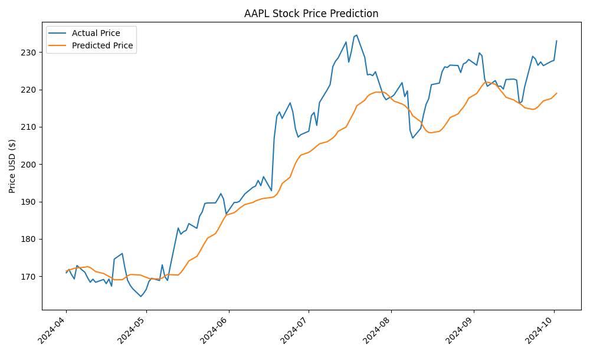

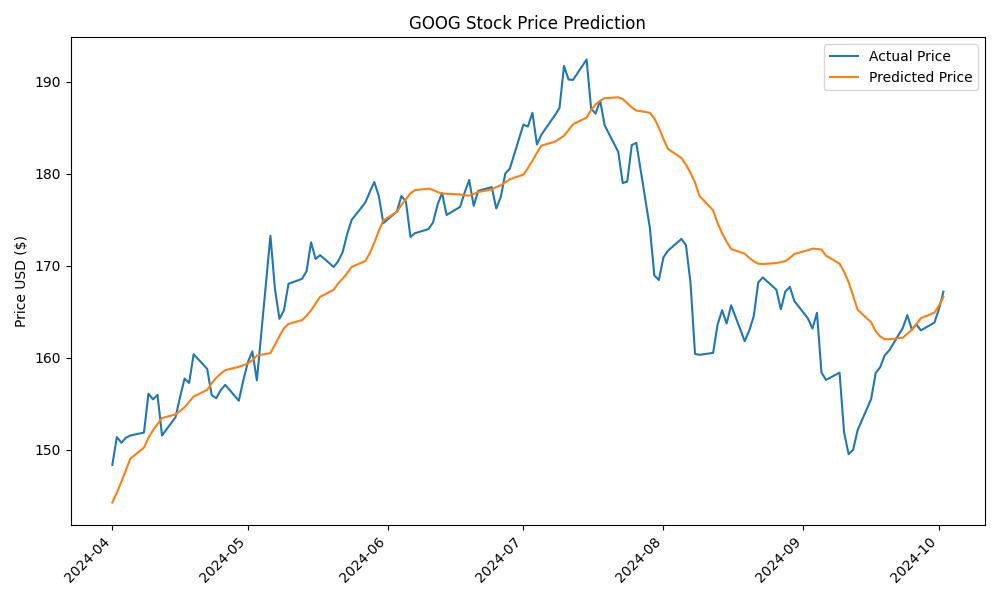

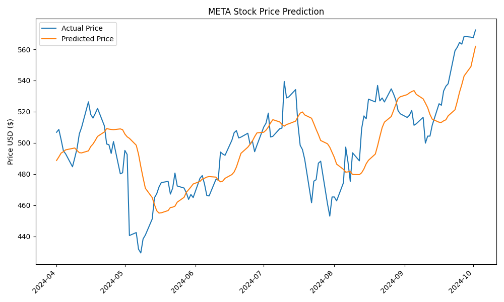

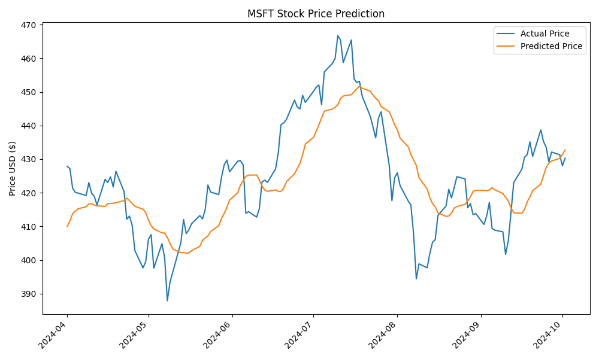

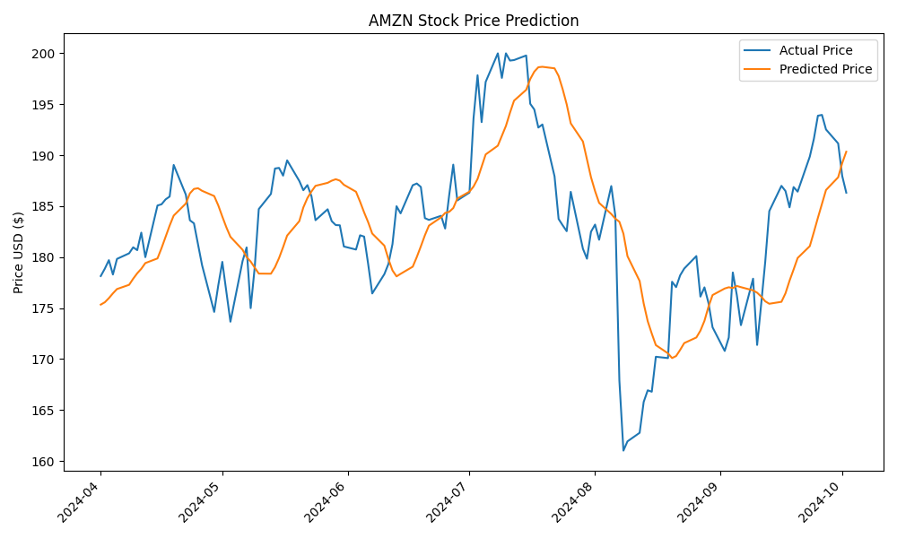


After many iterations, I found these hyperparameters to be most successful. 
```python
input_size = X_train.shape[2]
hidden_size = 128
num_layers = 2
output_size = 1
num_epochs = 300
learning_rate = 0.0001
dropout = 0.2
patience = 200  # For early stopping
```

Each ticker had varying performance, depending on those hyperparameters. 

I found that the lower the SMAPE value, the better the future predictions would be. So that's what I tried to optomize in my training between with the various tickers. 


Additional evaluation metrics included **Root Mean Squared Error (RMSE)**, **Mean Absolute Error (MAE)**, **R-squared**, and **Directional Accuracy**:

- RMSE: Measures the standard deviation of prediction errors.
- MAE: Represents the average absolute difference between predicted and actual values.
- R-squared: Indicates the proportion of variance explained by the model.
- Directional Accuracy: Assesses the model's ability to predict the direction of price movement.

The performance metrics were calculated as follows:
```python
rmse = np.sqrt(mean_squared_error(y_test_inversed, y_pred_inversed))
mae = mean_absolute_error(y_test_inversed, y_pred_inversed)
r2 = r2_score(y_test_inversed, y_pred_inversed)

def smape(A, F):
    return 100 / len(A) * np.sum(2 * np.abs(F - A) / (np.abs(A) + np.abs(F) + 1e-8))

smape_value = smape(y_test_inversed, y_pred_inversed)
direction_actual = np.sign(y_test_inversed[1:] - y_test_inversed[:-1])
direction_predicted = np.sign(y_pred_inversed[1:] - y_pred_inversed[:-1])
directional_accuracy = np.mean(direction_actual == direction_predicted) * 100
```

### Prediction Outcomes
The prediction results for the next seven trading days were obtained for each ticker. Since actual future prices are unavailable at the time of prediction, the model estimates adjusted close prices based on the learned patterns.


---

### Predictions for AAPL

| Date       | Predicted ($) | Actual ($) | Error (%) |
|------------|---------------|------------|-----------|
| 2024-10-02 | 220.04        | 226.78     | -2.97%    |
| 2024-10-03 | 220.31        | 225.67     | -2.37%    |
| 2024-10-04 | 220.26        | 226.80     | -2.88%    |
| 2024-10-07 | 220.13        | 221.69     | -0.71%    |
| 2024-10-08 | 220.00        | 225.77     | -2.56%    |
| 2024-10-09 | 219.85        | 229.54     | -4.22%    |
| 2024-10-10 | 219.85        | N/A        | N/A       |

---

### Predictions for GOOG

| Date       | Predicted ($) | Actual ($) | Error (%) |
|------------|---------------|------------|-----------|
| 2024-10-02 | 167.63        | 167.31     | 0.19%     |
| 2024-10-03 | 168.43        | 167.21     | 0.73%     |
| 2024-10-04 | 169.05        | 168.56     | 0.29%     |
| 2024-10-07 | 169.63        | 164.39     | 3.19%     |
| 2024-10-08 | 169.87        | 165.70     | 2.51%     |
| 2024-10-09 | 169.95        | 163.06     | 4.23%     |
| 2024-10-10 | 169.78        | N/A        | N/A       |

---

### Predictions for META

| Date       | Predicted ($) | Actual ($) | Error (%) |
|------------|---------------|------------|-----------|
| 2024-10-02 | 566.34        | 572.81     | -1.13%    |
| 2024-10-03 | 570.40        | 582.77     | -2.12%    |
| 2024-10-04 | 574.16        | 595.94     | -3.65%    |
| 2024-10-07 | 578.19        | 584.78     | -1.13%    |
| 2024-10-08 | 580.02        | 592.89     | -2.17%    |
| 2024-10-09 | 582.40        | 590.51     | -1.37%    |
| 2024-10-10 | 585.23        | N/A        | N/A       |

---

### Predictions for MSFT

| Date       | Predicted ($) | Actual ($) | Error (%) |
|------------|---------------|------------|-----------|
| 2024-10-02 | 432.55        | 417.13     | 3.70%     |
| 2024-10-03 | 431.57        | 416.54     | 3.61%     |
| 2024-10-04 | 430.25        | 416.06     | 3.41%     |
| 2024-10-07 | 428.98        | 409.54     | 4.75%     |
| 2024-10-08 | 426.22        | 414.71     | 2.78%     |
| 2024-10-09 | 423.67        | 417.46     | 1.49%     |
| 2024-10-10 | 422.03        | N/A        | N/A       |

---

### Predictions for AMZN

| Date       | Predicted ($) | Actual ($) | Error (%) |
|------------|---------------|------------|-----------|
| 2024-10-02 | 190.76        | 184.76     | 3.25%     |
| 2024-10-03 | 190.36        | 181.96     | 4.62%     |
| 2024-10-04 | 189.46        | 186.51     | 1.58%     |
| 2024-10-07 | 188.82        | 180.80     | 4.44%     |
| 2024-10-08 | 187.85        | 182.72     | 2.81%     |
| 2024-10-09 | 186.82        | 185.17     | 0.89%     |
| 2024-10-10 | 186.09        | N/A        | N/A       |

---


### Overview of Model Performance

The LSTM models demonstrated varying degrees of accuracy across different stock tickers. Overall, the models achieved SMAPE values below 5% for most tickers, indicating robust predictive capabilities. Notably, the MSFT model exhibited the lowest SMAPE at 2.37%, while GOOG had the highest at 4.61%.


### Analysis of Metric Outcomes

- **SMAPE (Symmetric Mean Absolute Percentage Error):** 
  - **AAPL (3.18%)** and **AMZN (2.93%)** showcased the most accurate predictions, suggesting that the LSTM models effectively captured the temporal dependencies in these stocks.
  - **GOOG (4.61%)**, while higher, still remains within an acceptable range, indicating reasonable prediction accuracy given the stock's inherent volatility.

- **RMSE and MAE:** 
  - Lower RMSE and MAE values for **AMZN** and **MSFT** indicate that the models have minimized prediction errors, aligning closely with actual prices.
  - Higher RMSE for **META** (25.45) reflects greater variability in prediction errors, due to higher stock volatility and less predictable patterns.
- **R-squared:** 
  - **AAPL** exhibits a high R-squared value of 0.8702, suggesting that the model explains a significant portion of the variance in the stock prices.
  - Lower R-squared values for **GOOG** and **AMZN** indicate room for improvement in capturing the underlying price movements.


### Reasons Behind Performance Differences

- **Data Characteristics:**
  - **Volatility:** Stocks like **GOOG** and **META** exhibited higher volatility, making accurate predictions more challenging. The increased price fluctuations likely contributed to higher SMAPE and RMSE values.
  - **Trend Patterns:** **AAPL** and **MSFT** displayed more consistent trend patterns, allowing the LSTM models to capture and predict future prices more effectively.

- **Model Architecture and Hyperparameters:**
  - The chosen architecture with two LSTM layers and 128 hidden units provided sufficient capacity to model complex temporal dependencies for most tickers.
  - Hyperparameter tuning revealed that a lower learning rate (0.0001) and higher patience (200 epochs) helped stabilize training, especially for less volatile stocks.

- **Feature Engineering:**
  - Incorporating technical indicators like SMA, EMA, and RSI enhanced the model's ability to understand market trends and momentum, contributing to better predictive performance.
  - Date-related features captured seasonal patterns, which were particularly beneficial for stocks with recurring market behaviors.

- **Regularization Techniques:**
  - Implementing dropout layers and early stopping effectively prevented overfitting, ensuring that the models generalized well to unseen data. This was evident in the stable performance metrics across training and validation sets.


### Insights and Learnings

- **Potential for Improvement:** The lower performance of **GOOG** suggests that integrating additional features, such as sentiment analysis from financial news or social media, could enhance model robustness for highly volatile stocks.

- **Scalability Considerations:** While the current models perform well for the selected tickers, scaling to a broader range of stocks may require more sophisticated architectures or ensemble methods to maintain prediction accuracy.


## Conclusion
### Reflection
This project provided valuable insights into the application of LSTM networks for stock price prediction. One of the most intriguing aspects was realizing that a single model might not suffice for all tickers due to their distinct market dynamics. The process underscored the complexity of financial forecasting and the importance of customized modeling approaches.

The model predictions proved to be especially challenging, due to the different feature estimations needed to have the model function. With so many unknown parameters, the predictions become more and more uncertain. 

### Improvements
Future enhancements could include:

- **Feature Enrichment**: Incorporating additional technical indicators and external data sources like sentiment analysis from news and social media to enrich the feature set.
- **Ticker-Specific Models**: Developing individual models for each ticker to fine-tune hyperparameters and capture specific market behaviors. 
- **Ensemble Models for Metric Optimization**: Develop a model to focus on directional accuracy and combine it with the model above. A different model for classification, like RandomForest or XGBoost, could perform better with a directional classifier. I place a high importance on directional accuracy and I believe a model ensemble could be successful. 
- **Advanced Modeling Techniques**: Experimenting with alternative modeling techniques such as Gated Recurrent Units (GRUs) or Transformer models, which might offer better performance on sequential data.


## Stock Predictor App
### Application

A comprehensive **web application** was developed using **Streamlit**, allowing users to input a ticker symbol and receive predicted future stock prices based on the trained LSTM models. This section outlines the features, functionalities, and setup instructions for the web application.

**Features**
- User Input: Users can select one or multiple stock tickers from a predefined list and specify the number of days ahead for which they want predictions.
- Data Visualization: The app displays predicted prices in a tabular format and provides visual plots comparing actual and predicted prices.
- Interactive Interface: Enhanced with custom CSS for improved aesthetics and user experience.
**Key Components of** `app.py`
The `app.py` script orchestrates the web application's functionality. Below are the main components and their roles:

1. **Imports and Dependencies**
```python
import streamlit as st
import os
import torch
import pandas as pd
from datetime import datetime, timedelta
from PIL import Image  # For image handling

# Import necessary functions
from src.data_loading import download_ticker_data
from src.utils import load_model_and_scalers
from src.prediction import predict_future_prices_multiple_tickers
from src.technical_indicators import add_technical_indicators
from src.config import get_device  # Import get_device from config.py
```

2. **Utility Functions**

- Loading Metrics

    Loads performance metrics for a given ticker.

```python
def load_metrics(ticker, model_dir='saved_models'):
    """
    Loads performance metrics from the metrics.txt file for a given ticker.
    """
    metrics_path = os.path.join(model_dir, ticker, 'metrics.txt')
    if os.path.isfile(metrics_path):
        with open(metrics_path, 'r') as f:
            metrics = f.read()
        return metrics
    else:
        return "No metrics available."
```

- Displaying Plots

    Displays the actual vs. predicted prices plot for a given ticker.

```python
def display_plots(ticker, model_dir='saved_models'):
    """
    Displays the 'actual_vs_predicted.png' plot for a given ticker.
    """
    plots_dir = os.path.join(model_dir, ticker, 'plots')
    plot_file = 'actual_vs_predicted.png'
    plot_path = os.path.join(plots_dir, plot_file)
    if os.path.isfile(plot_path):
        image = Image.open(plot_path)
        st.image(image, use_column_width=True)  # Removed the caption to eliminate text below the image
```

3. **Custom CSS for Enhanced Visuals**

    Applies custom styling to improve the application's appearance.

```python
def local_css():
    st.markdown("""
        <style>
        .title {
            color: #4B8BBE;
            text-align: center;
        }
        .subheader {
            color: #FFA500;
        }
        /* Customize the sidebar */
        .sidebar .sidebar-content {
            background-color: #f0f2f6;
        }
        /* Style the table headers */
        thead th {
            background-color: #4B8BBE;
            color: white;
            font-weight: bold;
        }
        /* Hide index column in tables */
        .dataframe tbody tr th {
            display: none;
        }
        .dataframe thead th:first-child {
            display: none;
        }
        /* Button Styling */
        .stButton>button {
            color: white;
            background-color: #4B8BBE;
        }
        </style>
        """, unsafe_allow_html=True)
```

4. **Streamlit App Initialization**

    Sets up the Streamlit page configuration and applies custom CSS.
```python
# Initialize Streamlit app
st.set_page_config(page_title="Stock Price Prediction App", layout="wide")
local_css()

st.title("📈 Stock Price Prediction App")
```

5. Sidebar for User Inputs

    Allows users to select tickers and specify prediction parameters.

```python
# Create a sidebar for user inputs with a new header
st.sidebar.header("🔍 Prediction Options")  # Changed from "⚙️ Prediction Settings"

# User inputs
tickers = st.sidebar.multiselect(
    "Select Stocks to Predict:",
    ['AAPL', 'GOOG', 'META', 'MSFT', 'AMZN'],
    default=['AAPL']
)

# Automatically set start_date to 5 years ago from today
end_date = datetime.today()
start_date = end_date - timedelta(days=5*365)  # Approximate 5 years

# Number of days ahead input
num_days_ahead = st.sidebar.number_input(
    "Number of Days Ahead to Predict:",
    min_value=1,
    max_value=30,
    value=7,
    step=1
)
```
6. Run Prediction Button

    Triggers the prediction process when clicked.

```python
# Run Prediction Button
if st.sidebar.button("🚀 Run Prediction"):
    device = get_device()  # Get the device configuration
    # Removed the line that displays the device to the user

    # Display selected date range for user confirmation (optional)
    st.sidebar.success(f"Fetching data from {start_date.strftime('%Y-%m-%d')} to {end_date.strftime('%Y-%m-%d')}.")
```

7. **Data Downloading and Preparation**

    Downloads historical data and computes technical indicators for selected tickers.

```python
    # Download and prepare data
    ticker_data = {}
    for ticker in tickers:
        with st.spinner(f"🔄 Downloading data for {ticker}..."):
            df = download_ticker_data(ticker, start_date.strftime('%Y-%m-%d'), end_date.strftime('%Y-%m-%d'))
            df = add_technical_indicators(df)
            df.dropna(inplace=True)
            ticker_data[ticker] = df
```

8. **Generating Future Dates**

    Determines the future dates for which predictions are to be made.

```python
    # Generate future dates
    future_dates = []
    last_trained_date = end_date
    current_date = last_trained_date + timedelta(days=1)
    while len(future_dates) < num_days_ahead:
        if current_date.weekday() < 5:  # Weekdays only
            future_dates.append(current_date.strftime('%Y-%m-%d'))
        current_date += timedelta(days=1)
```

9. **Loading Models and Making Predictions**

    Loads the trained models and performs predictions for the specified tickers and dates.

```python
    # Load models and make predictions
    loaded_models = {}
    for ticker in tickers:
        with st.spinner(f"📦 Loading model for {ticker}..."):
            try:
                model, feature_scaler, target_scaler = load_model_and_scalers(ticker)
                loaded_models[ticker] = {
                    'model': model,
                    'feature_scaler': feature_scaler,
                    'target_scaler': target_scaler
                }
            except Exception as e:
                st.error(f"❌ Failed to load model for {ticker}: {e}")

    # Make predictions
    with st.spinner("🤖 Making predictions..."):
        all_predictions = predict_future_prices_multiple_tickers(
            tickers,
            future_dates,
            loaded_models,
            ticker_data,
            sequence_length=60,
            device=device  # Pass the device to prediction functions
        )
```
10. **Displaying Predictions and Plots**

    Presents the prediction results and associated plots to the user.

```python
   # Display predictions and plots
   for ticker, predictions in all_predictions.items():
       st.markdown(f"### 📊 Predictions for {ticker}:")
       if predictions:
           df_predictions = pd.DataFrame.from_dict(predictions, orient='index', columns=['Predicted Price'])
           # Add 'Dates' as a separate column and remove the default index
           df_predictions.index.name = 'Dates'
           df_predictions = df_predictions.reset_index(drop=True)
           df_predictions.insert(0, 'Dates', list(predictions.keys()))
           # Format the predicted prices with '$' and two decimal places
           df_predictions['Predicted Price'] = df_predictions['Predicted Price'].apply(lambda x: f"${x:,.2f}")
           st.table(df_predictions)  # Use table for better formatting

           # Display metrics (commented out)
           # metrics = load_metrics(ticker)
           # st.text(metrics)

           # Display only 'actual_vs_predicted.png' plot
           display_plots(ticker)
       else:
           st.write("No predictions available.")

   st.success("✅ Predictions completed successfully!")
```

### Screenshots from Streamlit App

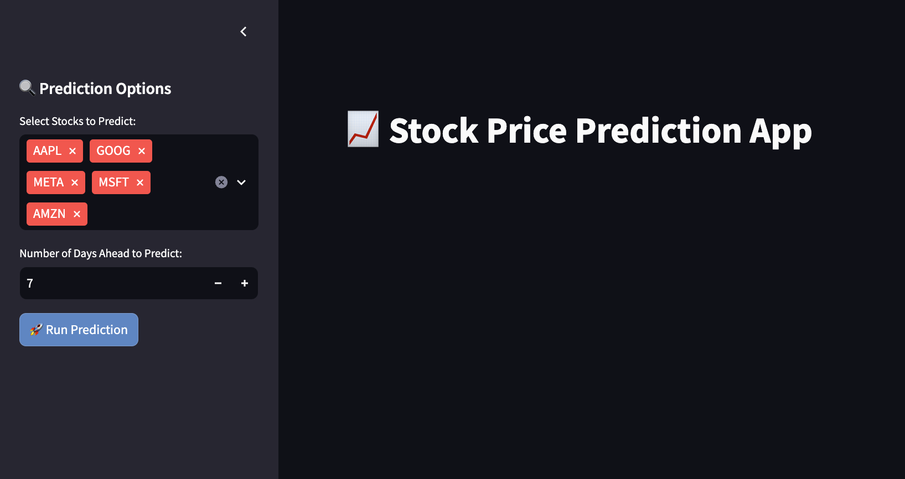

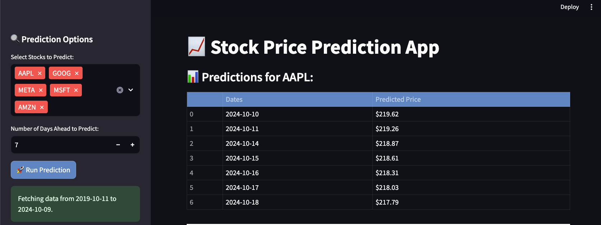

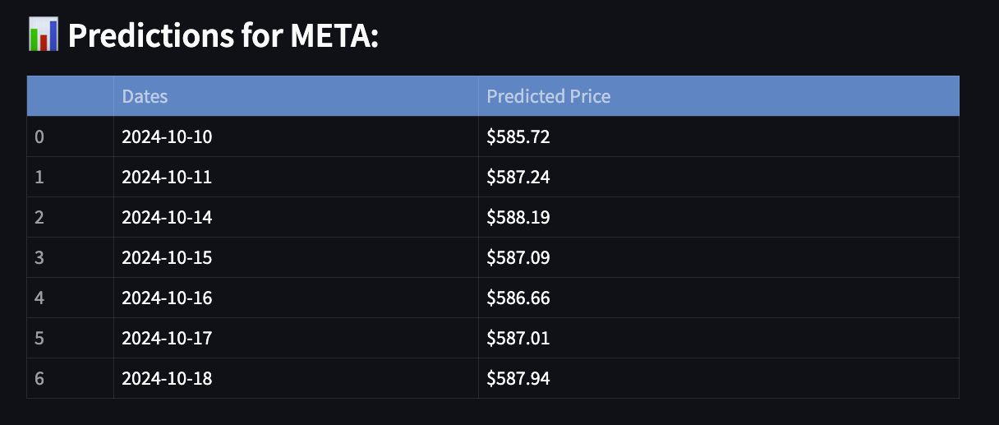

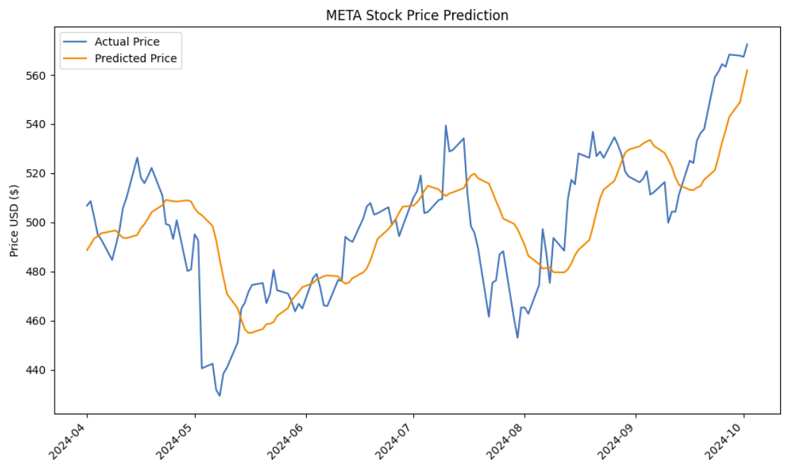

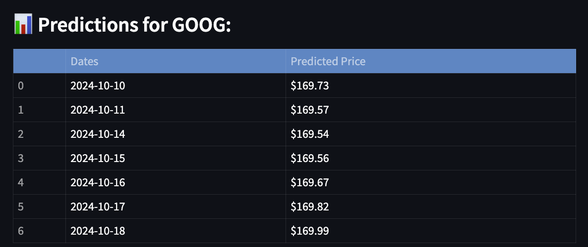

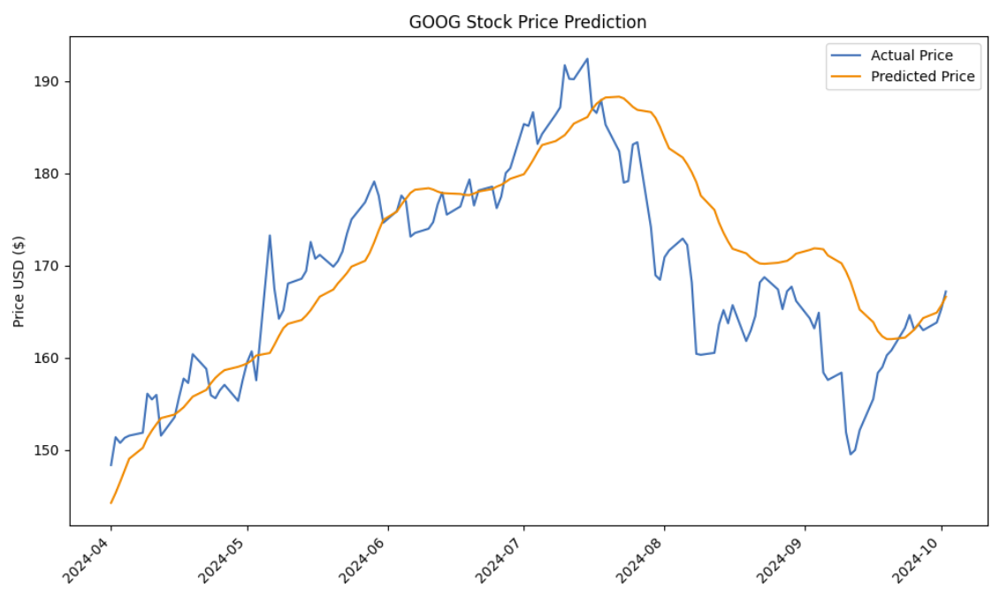


**Running the Application Locally**
To run the web application locally, follow these steps:

1. **Clone the Repository**

```bash
git clone https://github.com/robertholzmann/lstm_stock_predictor.git
cd lstm-stock-predictor
```

2. **Set Up the Environment**

    It's recommended to use a virtual environment to manage dependencies.

```bash
python3 -m venv venv
source venv/bin/activate  # On Windows: venv\Scripts\activate
```

3. **Install Dependencies**

```bash
pip install -r requirements.txt
```

4. **Run the Streamlit App**

```bash
streamlit run app.py
```

5. **Access the Application**

Once the app is running, open your browser and navigate to the URL provided in the terminal (typically `http://localhost:8501`).

**Dependencies**

The application relies on the following libraries:

- **Streamlit**: For building the web interface.
- **PyTorch**: For implementing and running the LSTM models.
- **Pandas**: For data manipulation and analysis.
- **NumPy**: For numerical computations.
- **Matplotlib**: For plotting graphs.
- **Joblib**: For saving and loading scaler objects.
- **PIL (Pillow)**: For image handling in Streamlit.
- **Other Utilities**: Such as `datetime`, `os`, and custom modules from the `src` directory.

Ensure all dependencies are listed in the `requirements.txt` file for seamless installation.

**Custom Modules**

The application utilizes custom modules located in the `src` directory:

- **data_loading.py**: Handles downloading and preparing stock data.
- **utils.py**: Contains utility functions, including model and scaler loading.
- **prediction.py**: Manages the prediction logic for single and multiple tickers.
- **technical_indicators.py**: Computes technical indicators required for model inputs.
- **config.py**: Configures device settings (CPU or GPU) for model computations.

Ensure these modules are correctly implemented and accessible to the `app.py` script.

**Error Handling**

The application includes error handling to manage scenarios such as:

- Model or Scaler Not Found: Displays an error message if the model or scaler files are missing for a selected ticker.
- Invalid Ticker Selection: Alerts the user if no valid tickers are selected for prediction.
- Data Download Issues: Notifies the user if there are problems fetching historical data.

**User Experience Enhancements**

- **Loading Indicators**: Streamlit's spinner is used to inform users when data is being downloaded, models are loading, and predictions are being made.
- **Custom Styling**: CSS is applied to enhance the visual appeal of the application, including coloring, table styling, and button customization.
- **Responsive Design**: The layout is configured to be wide, ensuring compatibility across different screen sizes.


## Project Structure

```plaintext
lstm_stock_predictor/
│
├── app.py                   # Entry point for the Streamlit web app
├── requirements.txt         # Project dependencies
├── .gitignore               # Git ignore file
│
├── saved_models/            # Folder for storing trained models, related files and graphs. Full model visualizations within plots folder of each ticker.
│   ├── AAPL/
│   │   ├── model.pth
│   │   ├── scalers.pkl
│   │   ├── loss_values.npy
│   │   ├── metrics.txt
│   │   └── plots/
│   │       ├── train_val_loss.png
│   │       ├── residuals_vs_predicted.png
│   │       ├── residuals_histogram.png
│   │       └── actual_vs_predicted.png
│   ├── MSFT/
│   │   ├── model.pth
│   │   ├── scalers.pkl
│   │   ├── loss_values.npy
│   │   ├── metrics.txt
│   │   └── plots/
│   │       ├── train_val_loss.png
│   │       ├── residuals_vs_predicted.png
│   │       ├── residuals_histogram.png
│   │       └── actual_vs_predicted.png
│   ├── GOOG/
│   │   ├── model.pth
│   │   ├── scalers.pkl
│   │   ├── loss_values.npy
│   │   ├── metrics.txt
│   │   └── plots/
│   │       ├── train_val_loss.png
│   │       ├── residuals_vs_predicted.png
│   │       ├── residuals_histogram.png
│   │       └── actual_vs_predicted.png
│   └── ...                  # Additional tickers
│
├── src/                     # Source code folder
│   ├── __init__.py
│   ├── data_loading.py
│   ├── data_processing.py
│   ├── technical_indicators.py
│   ├── models/
│   │   └── lstm_model.py
│   ├── training.py
│   ├── evaluation.py
│   ├── prediction.py
│   └── utils.py
│
├── notebooks/                # Jupyter notebooks used for creating the model and data exploration
│   ├── data_exploration.ipynb
│   ├── prediction_model.ipynb
└── README.md                # Project description
```


### License
This project is licensed under the MIT License.


## Acknowledgements
- **Streamlit** for the web application framework.
- **PyTorch** for the machine learning library.
- **Yahoo Finance** for providing historical stock data.
- **Udacity** for their wonderful Data Science Nanodegree Program.


